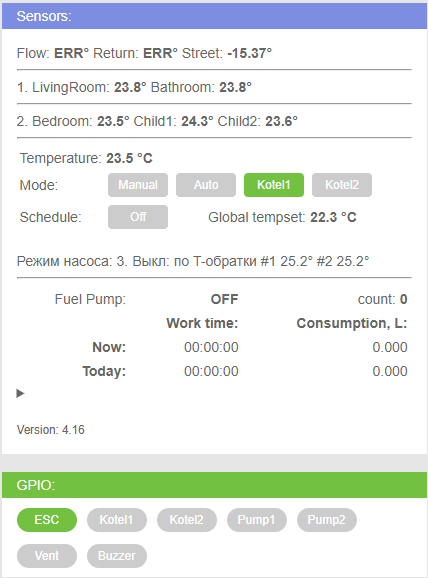
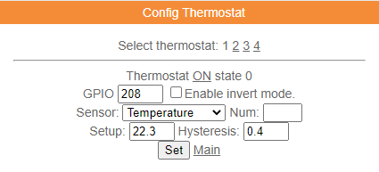
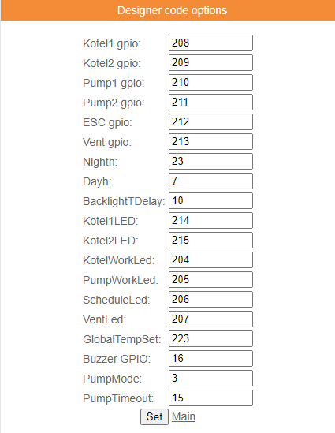
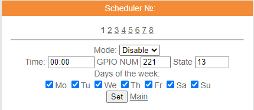
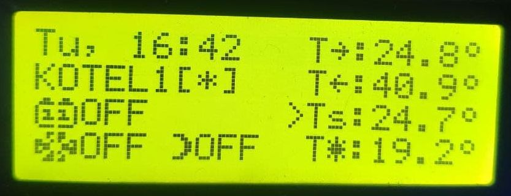
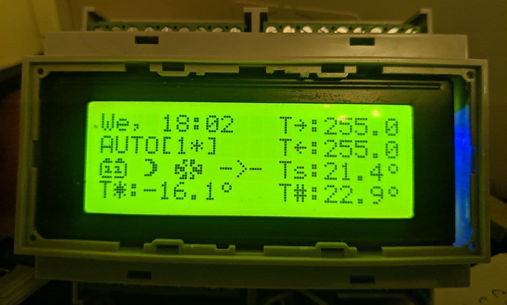
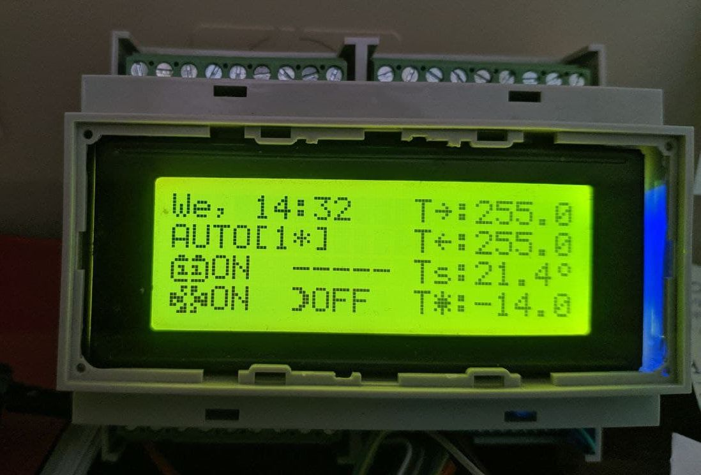
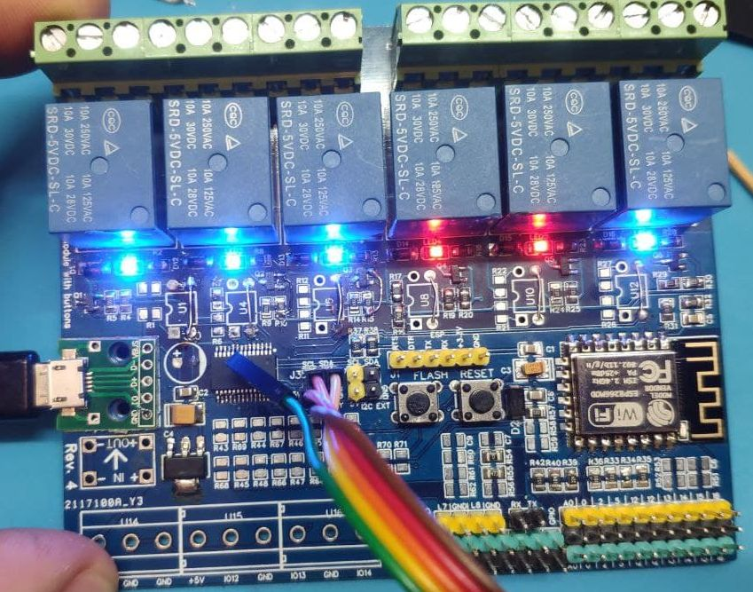

Прошивка на основе проекта wifi-iot.com + кастомизация через Конструктор Кода.

Предназначена для устройста на основе ESP12F (8266) + MCP23017 с поддержкой 6-и реле в корпусе 6DIN.

Управление 2-мя котлами (в моем случае дизельный + электрический).

При сборе прошивки должно быть включено 4 термостата:

1. для котла 1

2. для котла 2

3. для насоса котла 1

4. для насоса котла 2

**Можно управлять устройством кнопками**

1. Переключение режима работы котлов

1.1 AUTO - в зависимости от заданного времени суток включается термостат для KOTEL1 или KOTEL2

1.2 KOTEL1 - управляется термостатом 1

1.3 KOTEL2 - управляется термостатом 2

1.4 MANUAL - котлы включаются в ручную (не термостаты!)

При включении котла включается реле соответствующего насоса.

Если котел работает в авторежиме (AUTO/KOTEL1/KOTEL2), насос выключается автоматически в зависимости от опции PumpMode:

0. Ручное управление - долгое нажатие кнопки 4 или через web интерфейс / mqtt

1. выключается при выключении реле соответствующего котла

2. выключается через PumpTimeout сек после выключения реле соответствующего котла

3. выключается по температуре обратки (используются термостаты 3 или 4 для котла 1 или 2)

Можно подключить на реле - 2 котла (контакты термостата) + 2 насоса + вентилятор вытяжки.

**В моем случае:**

+Реле 1. Дизельный котел

+Реле 2. Электрический котел

-Реле 3. Циркуляционный насос для дизельного котла

-Реле 4. Не используется, т.к. в электрическом котле свой встроенный насос

-Реле 5. Режим ESC электрического котла Protherm Скат (разомкнутые контакты отключают котел)

-Реле 6. Вентилятор вытяжки

Так же прошивка может считать примерной расход дизеля. С топливного насоса дизельного котла берем сигнал с помощью устройства детекта наличия 220v (через оптопару pc817), есть сигнал - топливо тратится, нет сигнала - не тратится. Через опцию "Счетчик 60" считаем расход по времение, пока насос качает.

**Главная страница:**

Flow - температура подачи - dsw1 

Return - температура обратки - dsw2

Уличная температруа берется из переменной valdes2

Текущая температура для термостатов 1 и 2 берется из переменной valdes1 или переменной "Temperature" (что одно и тоже), это надо выбрать в настройках термостата
Данную температуру нужно обновлять либо интерпретер valdesset(0,XXX), либо по mqtt. В формате x10.

Уставка термостатов 1 и 2. Первоначально вручную прописывается температура в формате xx.y с одним знаком после запятой. Аналогично задается гистерезис. Далее нужно в Options задать желаемую уставку для постоянного режима (не работа по расписанию) - параметр GlobalTempSet в формате х10, т.е. 22.3 должно записываться как 223. Более уставку в термостатах 1 и 2 не нужно изменять вручную!!! Она прописывается автоматически прошивкой, руками изменять не надо!!! Если расписание включено, то уставка автоматически берется из планировщика и прописывается в термостаты, если расписание выключено - то берется из опции GlobalTempSet.

Уставка и гистерезис для термостатов 3 и 4 (для управления насосом в определенном режиме) задаются руками в формате xx.y с одним десятичным знаком.

**Настройки:**

**Управление расписанием:**

Сделано на основе опции "Планировщик".

**ВАЖНО! Параметр Mode должен быть выставлен в Disable, а параметр State не имеет значения (не учитывается)**

 [Расписание2](schedule_2.png) [Расписание3](schedule_3.png)

**Дисплей:**

версия 4.16

[Дисплей2](lcd_main_3.jpg) [Дисплей3](lcd_main_4.jpg) [Дисплей4](lcd_main_5.jpg) [Дисплей5](lcd_main_6.jpg)

версия 4.17

**Устройство:**

**Плата:**

